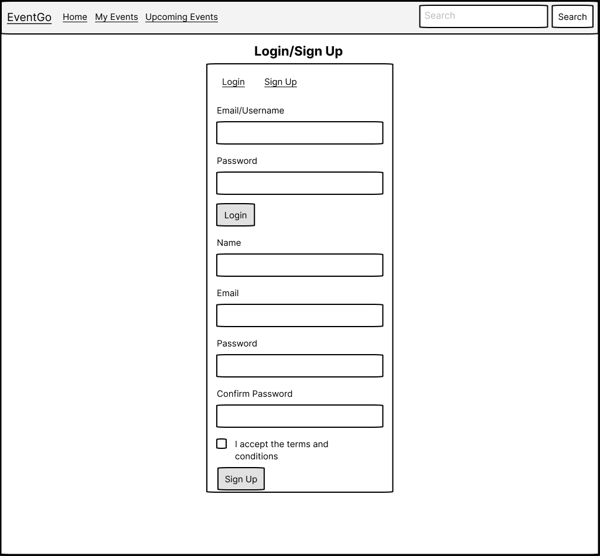
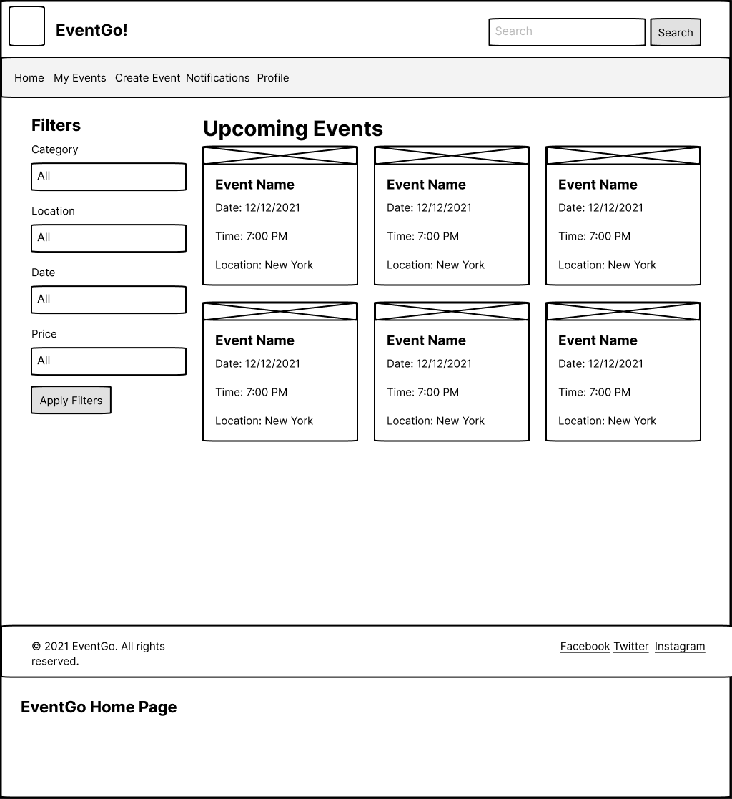
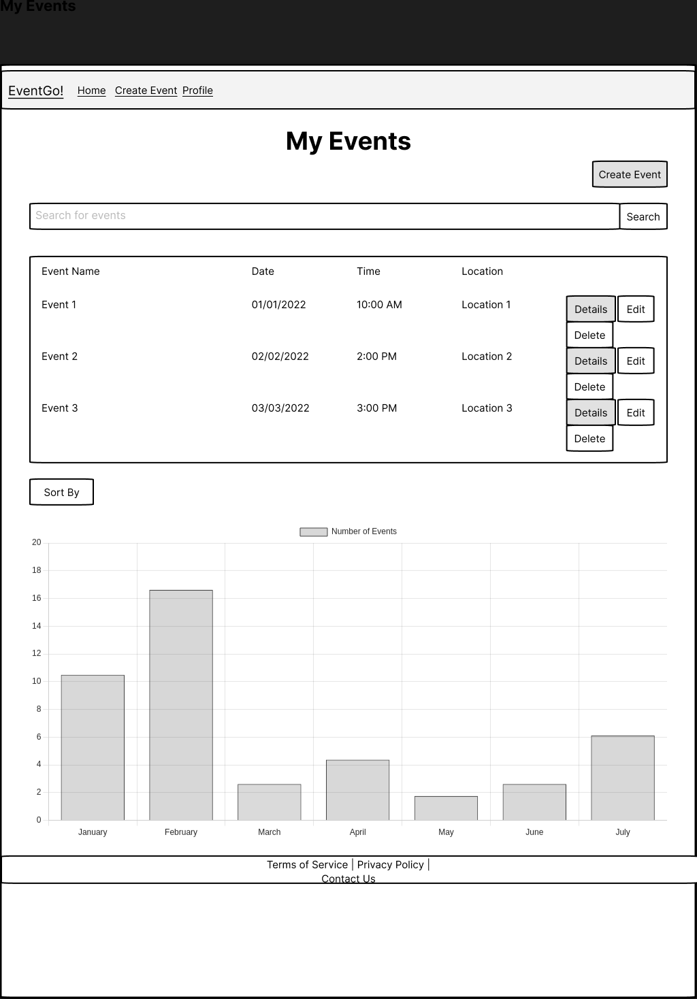
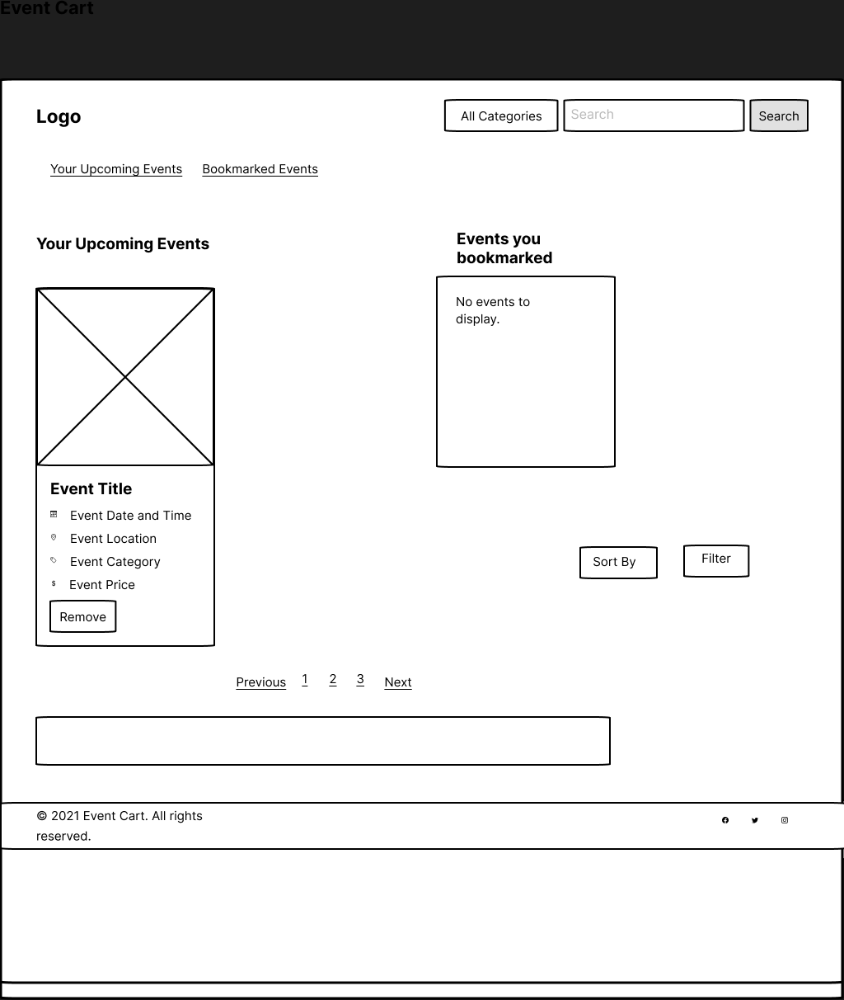
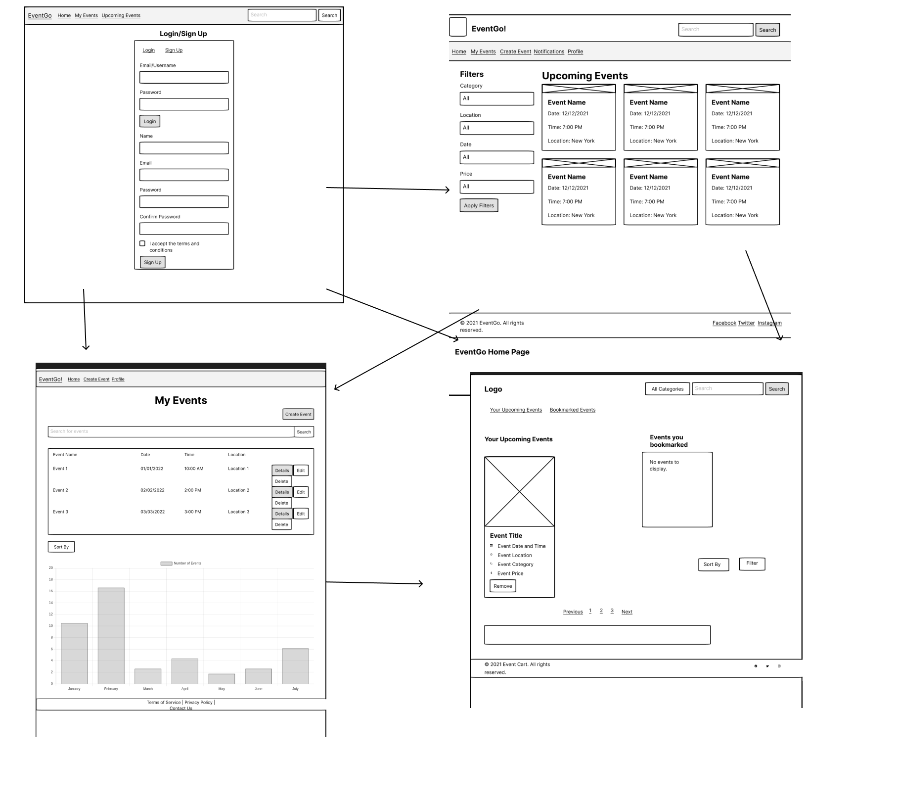

# EventGo! - An Event Management System

## Overview

EventGo! is an Event Management System (EMS) - a web application that simplifies event planning and registration. Users can register, create, and manage events, making it easy to host and attend events. Once signed up, a user can log in to add events and view their upcoming/saved/posted events.

## Data Model

The application stores Users, Events, and Registrations:

- Users can create and post events and register for other events.
- Each event can have multiple user registrations.
- Users can register for multiple events. (via references)

An Example User:

```javascript
{
  username: "eventplanner",
  hash: // a password hash,
  events: // an array of references to Event documents,
  events_registered: // an array of references to Event documents
}
```

An Example Event with Users:

```javascript
{
  organizer: // a reference to a User object
  name: "Tech Conference",
  date: "2023-12-01",
  location: "Virtual",
  description: "A conference on the latest tech trends.",
  registrations: [
    { user: // a reference to a User, attended: true },
    { user: // a reference to a User, attended: false },
  ],
  createdAt: // timestamp
}
```


## [Link to Commented First Draft Schema](db.mjs) 

## Wireframes

(__TODO__: wireframes for all of the pages on your site; they can be as simple as photos of drawings or you can use a tool like Balsamiq, Omnigraffle, etc.)

/login - page for login or sign up



/allevents- page for showing all events and adding new events



/myevents - page for showing events you added



/saved - page for showing events you saved/registered for



## Site map
Arrows may not be very accurate but point is that all pages can be navigated in any order other than the login page which always comes first. A user needs to login or signup before they proceed in the app. Once in, they can jump between pages as they like.



## User Stories or Use Cases

1. As a non-registered user, I can register a new account.
2. As a user, I can log in to the site.
3. As a user, I can create a new event.
4. As a user, I can view all the events I've created.
5. As a user, I can view event details.
6. As a user, I can register for events.

## Research Topics
  
* (5 points) Integrate user authentication
    * I'm going to be using passport.js for user authentication
* (4 points) Perform client-side form validation using a JavaScript library
* (3 points) Configuration management
    * dotenv
    * nconf
* (6 points) Use a front-end framework
    * React
* Use a javascript library for some type of data visualization for example to visualize a calendar/trends/number of events every month etc
I may not include all of these, but I will research these initially to shortlist the ones I want to use.

User input validation:
* User cannot register without entering both username and password
* Ensures all required fields for an event (time, date, location,etc) are input before an event is added by using 'required' in form
* Ensure date entered by user is valid by using type='date' in form
* 

## [Link to Initial Main Project File](app.mjs) 
  
## Annotations / References Used

I have not written much code other than the schemas yet so no references so far. 
